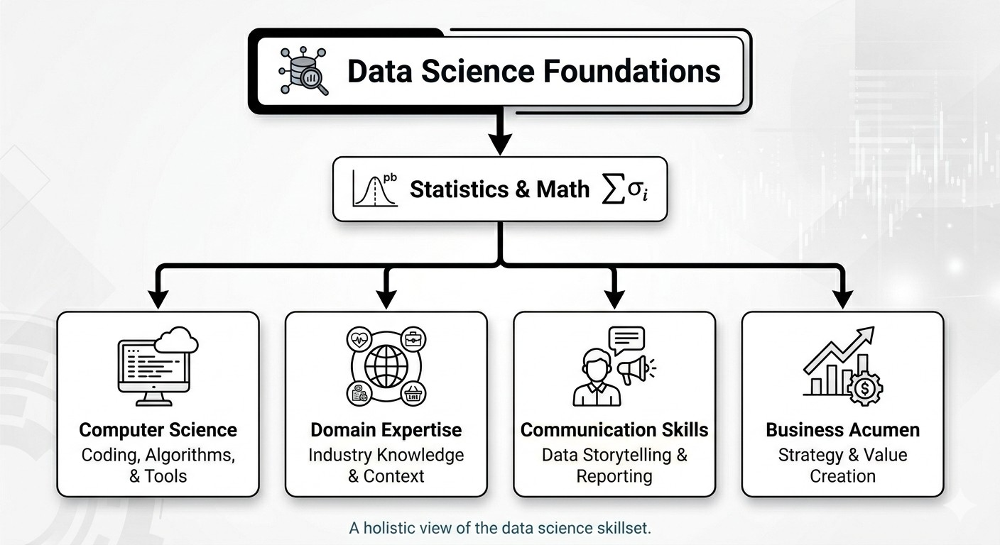

# What is Data Science? 🧠

## Overview

Data science is an interdisciplinary field that combines statistics, computer science, and domain expertise to extract meaningful insights from data. It's the art and science of turning raw data into actionable knowledge.

## What is Data Science?

At its core, data science is about **asking questions** and **finding answers** using data. It involves:

- **Collecting** data from various sources
- **Cleaning** and preparing data for analysis
- **Exploring** data to find patterns
- **Modeling** data to make predictions
- **Communicating** insights to stakeholders

## Simple Analogy

Think of data science like being a detective:

1. **You have clues** (raw data)
2. **You investigate** (analyze and explore)
3. **You find patterns** (discover insights)
4. **You solve the case** (make data-driven decisions)

## Why Data Science Matters

### In Business
- Make better decisions based on data, not gut feeling
- Understand customer behavior
- Optimize operations and reduce costs
- Predict future trends

### In Society
- Improve healthcare outcomes
- Fight climate change
- Enhance education
- Make cities smarter

### In Daily Life
- Personalized recommendations (Netflix, Amazon)
- Voice assistants (Siri, Alexa)
- Fraud detection in banking
- Route optimization (Google Maps)

## Data Science vs Related Fields

| Field | Focus |
|-------|-------|
| **Data Science** | Extracting insights and building predictive models |
| **Data Analytics** | Analyzing historical data to answer questions |
| **Machine Learning** | Algorithms that learn from data |
| **AI** | Creating systems that mimic human intelligence |
| **Statistics** | Collecting, analyzing, and interpreting data |
| **Data Engineering** | Building infrastructure for data collection and storage |

## The Three Pillars of Data Science

### 1. Statistics & Mathematics
- Probability
- Statistical testing
- Linear algebra
- Calculus

### 2. Computer Science
- Programming (Python, R)
- Databases (SQL)
- Machine Learning
- Big Data technologies

### 3. Domain Expertise & Communication
- Understanding the business/problem
- Asking the right questions
- Storytelling with data
- Presenting insights

## Real-World Examples

### Example 1: Healthcare
A hospital uses data science to:
- Predict which patients are at risk of readmission
- Identify early signs of disease
- Optimize staff scheduling

### Example 2: E-commerce
An online store uses data science to:
- Recommend products customers might like
- Detect fraudulent transactions
- Forecast inventory needs

### Example 3: Finance
A bank uses data science to:
- Assess credit risk
- Detect money laundering
- Personalize financial products

## Key Skills of a Data Scientist

**Technical Skills:**
- Python or R programming
- SQL
- Statistics and probability
- Machine Learning
- Data visualization

**Soft Skills:**
- Problem-solving
- Critical thinking
- Communication
- Business acumen
- Curiosity

## Common Misconceptions

❌ **"Data science is only about machine learning"**
- ML is a part, but data cleaning, analysis, and communication are equally important

❌ **"You need a PhD to be a data scientist"**
- Many successful data scientists come from diverse backgrounds with practical skills

❌ **"Data science is just statistics"**
- It combines statistics with programming, domain knowledge, and communication

❌ **"More data always means better results"**
- Quality of data matters more than quantity

## Reflection Questions

1. In your own words, what is data science?
2. Can you think of a recent example where a company used data to make a decision that affected you?
3. Which of the three pillars (statistics, computer science, domain expertise) do you think is your strongest?
4. What excites you most about learning data science?

## Key Takeaways

- Data science turns raw data into actionable insights
- It combines multiple disciplines: statistics, programming, and domain knowledge
- Data scientists need both technical and soft skills
- Applications span across every industry

## Next Steps

- Proceed to [02_data_science_lifecycle.md](./02_data_science_lifecycle.md) to understand the step-by-step process
- Reflect on how data science might apply to your interests or industry

---

*"Data scientist: The sexiest job of the 21st century" - Harvard Business Review*
