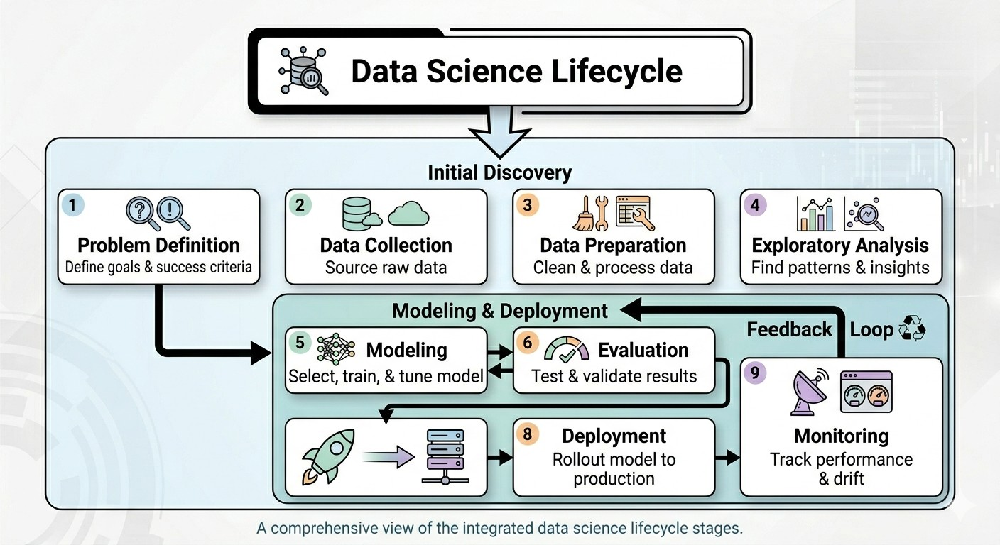

# Data Science Lifecycle 🔄

## Overview

The data science lifecycle is a structured approach to solving problems with data. It provides a framework from understanding the problem to deploying and maintaining solutions.

## The Complete Lifecycle



## Stage 1: Problem Definition

**Goal:** Understand what problem needs to be solved

**Key Questions:**
- What business problem are we solving?
- What are the success criteria?
- Who are the stakeholders?
- What resources are available?

**Deliverable:** Project charter with clear objectives and success metrics

**Example:**
- Problem: Customers are leaving (churning)
- Goal: Predict which customers are likely to churn
- Success: Reduce churn by 10% within 6 months

## Stage 2: Data Collection

**Goal:** Gather relevant data from available sources

**Sources:**
- Internal databases
- APIs
- Web scraping
- Third-party data providers
- Surveys
- Public datasets

**Key Questions:**
- What data do we need?
- Where can we get it?
- How much data is enough?
- Is the data reliable?

**Deliverable:** Raw datasets with documentation

## Stage 3: Data Preparation

**Goal:** Clean and transform raw data for analysis

**Activities:**
- Handle missing values
- Remove duplicates
- Fix data types
- Handle outliers
- Standardize formats
- Merge multiple sources

**Time Spent:** Often 60-80% of the project time

**Deliverable:** Clean, structured dataset

```python
# Example: Data cleaning in Python
import pandas as pd

df = pd.read_csv('raw_data.csv')

# Handle missing values
df.dropna(subset=['important_column'], inplace=True)
df['age'].fillna(df['age'].median(), inplace=True)

# Remove duplicates
df.drop_duplicates(inplace=True)

# Fix data types
df['date'] = pd.to_datetime(df['date'])
```

## Stage 4: Exploratory Data Analysis (EDA)

**Goal:** Understand patterns, relationships, and insights in the data

**Activities:**
- Summary statistics
- Visualizations
- Correlation analysis
- Identify patterns and anomalies
- Form hypotheses

**Deliverable:** EDA report with visualizations and insights

```python
# Example: EDA in Python
import matplotlib.pyplot as plt
import seaborn as sns

# Summary statistics
print(df.describe())
print(df.info())

# Distribution
sns.histplot(df['age'])
plt.show()

# Correlation
sns.heatmap(df.corr(), annot=True)
plt.show()
```

## Stage 5: Modeling

**Goal:** Build models to make predictions or discover patterns

**Types of Models:**
- **Supervised Learning:** Predict target variable
  - Regression (predict numbers)
  - Classification (predict categories)
- **Unsupervised Learning:** Find patterns
  - Clustering (group similar items)
  - Dimensionality reduction
- **Deep Learning:** Complex patterns (images, text)

**Process:**
1. Split data (train/validation/test)
2. Select algorithms
3. Train models
4. Tune hyperparameters

**Deliverable:** Trained models with performance metrics

## Stage 6: Evaluation

**Goal:** Assess model performance and business impact

**Key Questions:**
- Does the model meet success criteria?
- Is it accurate enough?
- Does it generalize to new data?
- What are the limitations?

**Metrics:**
- **Classification:** Accuracy, Precision, Recall, F1, ROC-AUC
- **Regression:** MAE, MSE, RMSE, R²
- **Business:** ROI, cost savings, revenue impact

**Deliverable:** Model evaluation report

## Stage 7: Deployment

**Goal:** Put the model into production

**Deployment Options:**
- API endpoint
- Batch processing
- Embedded in applications
- Dashboard integration

**Tools:**
- Flask, FastAPI (Python APIs)
- Docker (containerization)
- Cloud platforms (AWS, GCP, Azure)

**Deliverable:** Live, accessible model

```python
# Example: Simple API with Flask
from flask import Flask, request, jsonify

app = Flask(__name__)

@app.route('/predict', methods=['POST'])
def predict():
    data = request.json
    prediction = model.predict(data)
    return jsonify({'prediction': prediction.tolist()})
```

## Stage 8: Monitoring & Maintenance

**Goal:** Ensure model continues to perform well

**Activities:**
- Track model performance over time
- Detect data drift
- Monitor for biases
- Retrain when needed
- Log predictions and feedback

**Key Metrics:**
- Prediction accuracy over time
- System uptime
- Response latency
- Data quality

**Deliverable:** Monitoring dashboard and maintenance schedule

## The Iterative Nature

The lifecycle is not always linear. Often you will:
- Return to earlier stages based on findings
- Iterate to improve results
- Try multiple approaches
- Incorporate feedback

```
Problem ──► Data ──► Model ──► Evaluate ──► Deploy
   ▲                                         │
   └─────────────────────────────────────────┘
              (Feedback Loop)
```

## Real-World Example: Customer Churn Prediction

| Stage | Activity |
|-------|----------|
| **Problem Definition** | Reduce customer churn by 15% |
| **Data Collection** | Customer demographics, usage logs, support tickets |
| **Data Preparation** | Clean missing values, create features (avg usage, days since last login) |
| **EDA** | Found that churned customers had lower usage in last 30 days |
| **Modeling** | Tested logistic regression, random forest, XGBoost |
| **Evaluation** | Random Forest achieved 85% precision, 80% recall |
| **Deployment** | Built API for real-time predictions |
| **Monitoring** | Track model performance monthly, retrain quarterly |

## Common Pitfalls

| Phase | Core Objective | ❌ Failure Mode (The Death Trap) |
| :--- | :--- | :--- |
| **01** | Problem Definition | **Solving the wrong problem -** Building a model without business alignment. |
| **02** | Data Collection | **Garbage in, garbage out -** Using biased, noisy, or irrelevant sources. |
| **03** | Data Preparation | **Scaling Systemic Bias -** Rushing cleaning and missing data leakage. |
| **04** | Exploratory Analysis | **Missing important patterns -** Failing to understand distributions/outliers. |
| **05** | Modeling | **Models that don't generalize -** Overfitting to historical noise. |
| **06** | Evaluation | **False sense of security -** Using the wrong metrics for the business case. |
| **07** | Deployment | **Models that never add value -** Keeping the model in a "lab" environment. |
| **08** | Monitoring | **Models that degrade over time -** Ignoring data drift and model rot. |

## Reflection Questions

1. Why is problem definition the most important stage?
2. Which stage do you think takes the most time? Why?
3. What might happen if you skip the EDA stage?
4. How is monitoring different from evaluation?

## Key Takeaways

- The lifecycle provides a structured approach to data science projects
- Each stage builds upon the previous one
- The process is iterative, not linear
- Most time is spent on data preparation and cleaning
- Success requires both technical and business understanding

## Next Steps

- Proceed to [03_applications.md](./03_applications.md) to see real-world examples
- Think about a problem you'd like to solve using this lifecycle

---

*"A good data scientist understands the business problem before touching the data."*