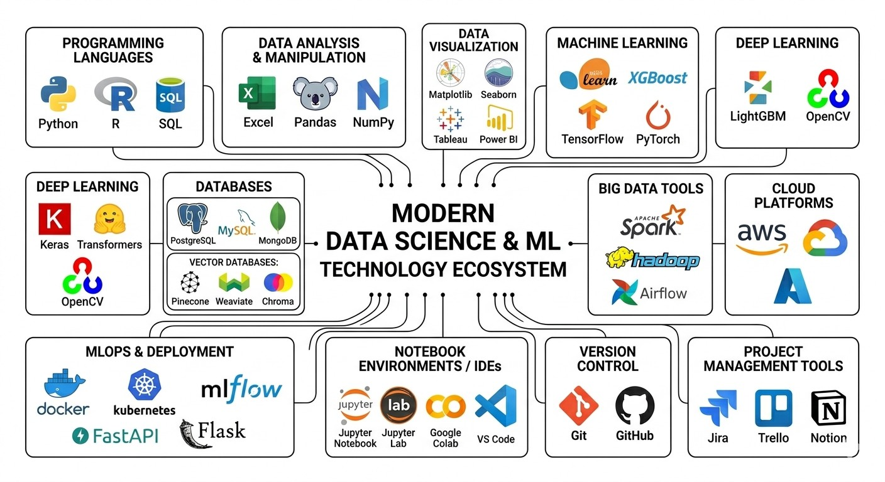

# Tools and Technologies 🛠️

## Overview

Data scientists use a variety of tools across the data science lifecycle. This file provides an overview of the essential tools you'll learn throughout this repository.

---

## Programming Languages

### Python 🐍
**The most popular language for data science**

- Easy to learn and read
- Massive ecosystem of libraries
- Great for: data analysis, machine learning, deep learning
- Libraries: Pandas, NumPy, Scikit-learn, TensorFlow

### R 📊
**Built specifically for statistics**

- Excellent for statistical analysis
- Beautiful visualizations with ggplot2
- Great for: academic research, advanced statistics
- Popular in: academia, research, biostatistics

### SQL 💾
**The language of databases**

- Extract data from databases
- Essential for any data role
- Great for: data retrieval, data manipulation

---

## Data Analysis & Manipulation

### Excel
- Great for quick analysis and business users
- Pivot tables, formulas, dashboards
- Used everywhere in business

### Pandas
- Python library for data manipulation
- DataFrames (like Excel in Python)
- Clean, transform, analyze data

### NumPy
- Numerical computing in Python
- Arrays and mathematical operations
- Foundation for other libraries

---

## Data Visualization

### Matplotlib
- Basic plotting library
- Highly customizable
- Foundation for other Python viz libraries

### Seaborn
- Statistical visualizations
- Built on Matplotlib
- Beautiful defaults

### Plotly
- Interactive visualizations
- Dashboards and web apps
- Great for sharing

### Tableau
- Industry-leading BI tool
- Drag-and-drop dashboards
- Enterprise standard

### Power BI
- Microsoft's BI tool
- Great integration with Excel
- Popular in corporate settings

---

## Machine Learning

### Scikit-learn
- Go-to library for traditional ML
- Consistent API
- Classification, regression, clustering

### XGBoost / LightGBM
- Gradient boosting libraries
- Top performers in competitions
- Handles tabular data well

### TensorFlow
- Google's deep learning framework
- Production-ready
- Great for large-scale projects

### PyTorch
- Facebook's deep learning framework
- More Pythonic and flexible
- Popular in research

---

## Deep Learning

### Keras
- High-level API for TensorFlow
- Easy to learn
- Great for beginners

### Transformers (Hugging Face)
- Pre-trained models for NLP
- BERT, GPT, and more
- State-of-the-art language models

### OpenCV
- Computer vision library
- Image and video processing
- Face detection, object recognition

---

## Databases

### PostgreSQL / MySQL
- Relational databases
- SQL queries
- Structured data storage

### MongoDB
- NoSQL database
- Document-based
- Flexible schema

### Vector Databases
- Pinecone, Weaviate, Chroma
- Store embeddings
- Used for LLM applications

---

## Big Data

### Apache Spark
- Distributed computing
- Process terabytes of data
- PySpark for Python users

### Hadoop
- Distributed storage
- Batch processing
- Foundation of big data

### Airflow
- Workflow orchestration
- Schedule and monitor data pipelines
- Industry standard

---

## Cloud Platforms

### AWS
- Most popular cloud provider
- S3 (storage), SageMaker (ML), Redshift (warehousing)
- Extensive data science services

### Google Cloud Platform
- Vertex AI
- BigQuery
- TensorFlow integration

### Microsoft Azure
- Azure ML
- Power BI integration
- Enterprise focus

---

## MLOps & Deployment

### Docker
- Containerization
- Consistent environments
- Easy deployment

### Kubernetes
- Container orchestration
- Scale applications
- Manage microservices

### MLflow
- Experiment tracking
- Model registry
- Deployment tools

### FastAPI / Flask
- Build APIs
- Deploy models as services
- Lightweight and fast

---

## Notebook Environments

### Jupyter Notebook
- Interactive coding
- Mix code and markdown
- Great for exploration

### Jupyter Lab
- Enhanced version of notebooks
- Multiple tabs and views
- Modern interface

### Google Colab
- Free GPU access
- Cloud-based
- Great for learning

### VS Code
- Popular code editor
- Excellent Python support
- Built-in notebook support

---

## Version Control

### Git
- Track code changes
- Collaborate with others
- Essential skill

### GitHub
- Host repositories
- Share projects
- Build portfolio

---

## Project Management

### Jira / Trello
- Track tasks
- Agile workflows
- Team collaboration

### Notion
- Documentation
- Project planning
- Personal knowledge base

---

## Tool Selection by Use Case

| Task | Recommended Tools |
|------|-------------------|
| Quick analysis | Excel, Python |
| Data manipulation | Pandas, SQL |
| Visualizations | Seaborn, Tableau, Power BI |
| ML models | Scikit-learn, XGBoost |
| Deep Learning | TensorFlow, PyTorch |
| Big Data | Spark |
| Deployment | Docker, FastAPI, AWS |
| Experiment tracking | MLflow |
| Team collaboration | Git, GitHub |

---

## Learning Path for Tools

### Beginner
1. Python basics
2. Pandas for data manipulation
3. Matplotlib & Seaborn for viz
4. Scikit-learn for ML
5. SQL for databases

### Intermediate
1. Jupyter notebooks
2. Git & GitHub
3. Tableau or Power BI
4. Basic cloud concepts
5. Docker

### Advanced
1. Spark for big data
2. TensorFlow or PyTorch
3. MLOps tools
4. Deep learning frameworks
5. Cloud ML services

---

## Which Tools to Focus On?

**If you're starting out:**
- Python (most versatile)
- SQL (always needed)
- Pandas (data manipulation)
- One visualization tool

**If you want to work in corporate:**
- Excel (everyone uses it)
- Power BI or Tableau
- SQL
- Python

**If you want to work in tech:**
- Python
- SQL
- Cloud platforms
- MLOps tools

---

## Reflection Questions

1. Which tools are you already familiar with?
2. What excites you most to learn?
3. How do you plan to practice these tools?

---

## Next Steps

- Proceed to [05_ethics_in_data_science.md](./05_ethics_in_data_science.md) to learn about responsible AI
- Pick one tool from each category and start exploring

---

*"Tools are just tools. The real skill is knowing which tool to use for which problem."*